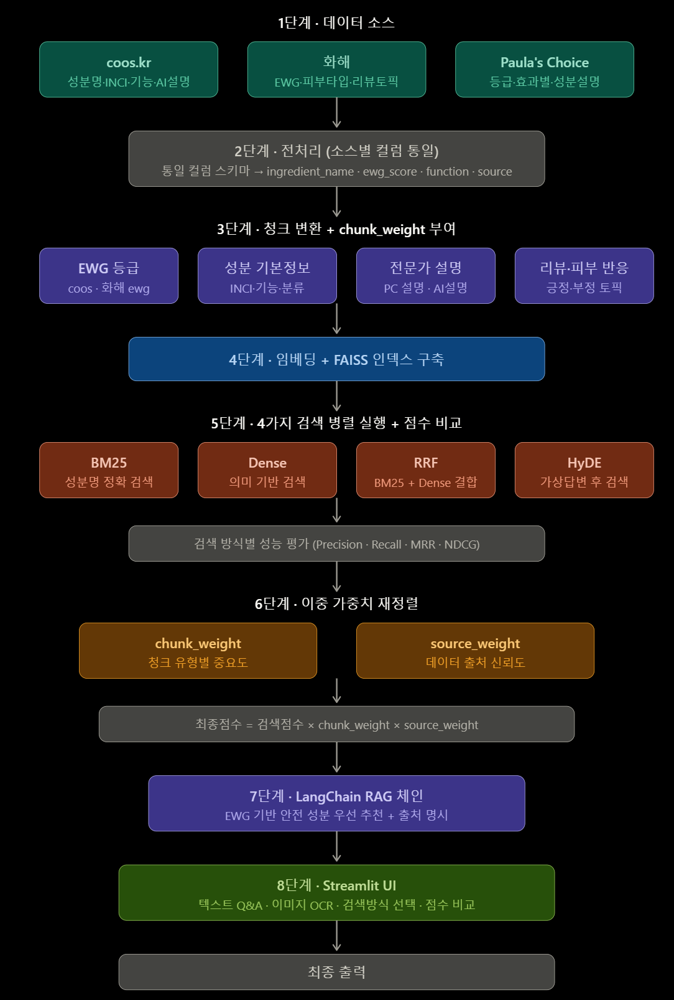
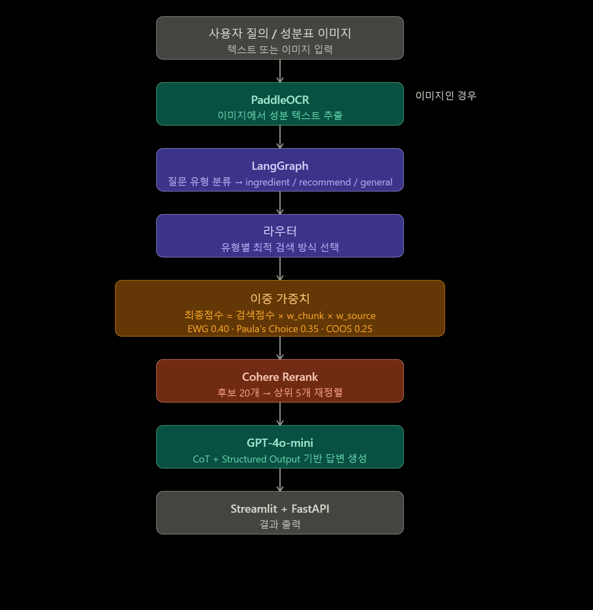

<h1 align="center">🫧 SkinCurator by Flow</h1>

<p align="center">
  <b>복수의 뷰티 데이터를 통합한 RAG 기반 AI 스킨케어 의사결정 서비스</b><br>
  파편화된 성분 정보를 통합하고, 개인 피부에 맞는 제품을 데이터 기반으로 추천합니다.
</p>

<p align="center">
  
  
  
  
  
  
  
  <a href="https://www.notion.so/ohgiraffers/3RD_PROJECT-33d649136c11806eb17fda8ac18be5f4"></a>
</p>

---

## ✨ Key Features

- 🔍 **하이브리드 검색** — BM25 + Dense + RRF로 키워드·의미 맥락을 동시 파악
- 🤖 **질문 유형 자동 라우팅** — 성분 분석·제품 추천·일반 질의를 분류해 최적 검색 방식 적용
- ⚖️ **WoE 기반 이중 가중치** — 출처 신뢰도 × 성분 중요도 조합으로 결과 정렬
- 🏅 **SAFE Score** — 안전성·효능을 통합한 S-A-B-C-D 5단계 성분 등급
- 📸 **OCR 성분표 인식** — PaddleOCR로 화장품 패키지 촬영 시 성분 자동 추출·분석

---

## 🚀 Getting Started

### 1. 설치

```bash
git clone https://github.com/your-org/flow.git
cd flow
pip install -r requirements.txt
cp .env.example .env   # OPENAI_API_KEY, COHERE_API_KEY 입력
```

### 2. 데이터 파이프라인

```bash
python 03_scripts/01_validate_raw.py   # raw 파일 검증
python 03_scripts/02_make_dataset.py   # 전처리 및 병합
python 03_scripts/03_build_features.py # 청킹

# FAISS 인덱스 생성 (OpenAI API 비용 발생)
for i in {1..4}; do python 03_scripts/04_train.py --preset_id $i; done
```

### 3. 서비스 실행

```bash
# 터미널 1 — FastAPI 백엔드
uvicorn api_server:app --reload

# 터미널 2 — Streamlit 프론트엔드
streamlit run streamlit_app.py
```

> ⚠️ 반드시 `flow/` 루트에서 실행 · FastAPI와 Streamlit 동시 구동 필요 · PaddleOCR 첫 실행 시 모델 자동 다운로드(수 분 소요)

---

## 🏗 시스템 아키텍처

### 전체 아키텍처


### RAG 파이프라인


---

## 🔬 Technical Deep Dive

<details>
<summary><b>📊 데이터 설계 & ERD</b></summary>

### ERD


4개 소스(coos.kr, 화해, Paula's Choice, 식약처 KFDA)의 이종 데이터를 **CAS No. → INCI 영문명 → KFDA 표준 한글명 → 이명 사전** 순서의 계층적 매핑으로 표준화합니다.

| 테이블 | 설명 | 주요 컬럼 |
| :--- | :--- | :--- |
| `ewg_chunk` | 성분별 안전 등급·점수 | `ingredient_ko`, `hw_ewg`, `coos_score`, `pc_grade` |
| `basic_info_chunk` | 기본 기능·카테고리 | `pc_effect`, `pc_category`, `coos_function`, `hw_purpose` |
| `expert_chunk` | 전문가 평가·국가별 기준 | `pc_description`, `coos_ai_desc`, `coos_KR`, `hw_category` |

</details>

<details>
<summary><b>⚖️ WoE 기반 가중치 시스템</b></summary>

SCCS·EFSA·WHO 가이드라인 기반으로 **Relevance(0.35) · Validity(0.35) · Reliability(0.2)** 3가지 기준을 산출·정규화합니다.

$$\text{최종점수} = \text{검색점수} \times w_{\text{chunk}} \times w_{\text{source}}$$

| 소스 | 가중치 | 근거 |
| :--- | :---: | :--- |
| EWG (화해) | 0.40 | 피부 자극·안전과 직접 관련, 대규모 데이터 |
| Paula's Choice | 0.35 | 전문가 논문 기반, 높은 과학적 타당성 |
| COOS | 0.25 | 국가별 규제 정보, 국내 특화 데이터 |

</details>

<details>
<summary><b>🔀 검색 모델 라우팅 & 실험 결과</b></summary>

LangGraph classify_node가 질문을 자동 분류한 뒤, NDCG@3 평가 기반으로 최적 검색 방식을 적용합니다.

| 질문 유형 | 선택 방식 | NDCG@3 | 예시 |
| :--- | :---: | :---: | :--- |
| ingredient | Dense | 1.444 | "나이아신아마이드 EWG 등급?" |
| recommend | BM25 | 1.822 | "지성 피부에 뭐 써?" |
| general | BM25 | 0.926 | "화장품 어떻게 보관?" |

**FAISS 프리셋 (청크 가중치)**

| 프리셋 | EWG | Basic Info | Expert | 용도 |
| :---: | :---: | :---: | :---: | :--- |
| Preset1 | 0.33 | 0.33 | 0.33 | general (균등) |
| Preset2 | 0.50 | 0.35 | 0.15 | ingredient (안전성 중심) |
| Preset3 | 0.40 | 0.45 | 0.15 | 안전성 + 기본정보 균형 |
| Preset4 | 0.45 | 0.45 | 0.10 | recommend |

</details>

<details>
<summary><b>📁 폴더 구조</b></summary>

```
flow/
├── 00_data/
│   ├── 00_raw/          # 원본 데이터
│   ├── 01_interim/      # 전처리 중간 산출물
│   └── 02_processed/    # 최종 RAG용 청크
├── 01_notebooks/        # 실험 로그
├── 02_src/
│   ├── 00_common/       # 설정 로더, 로거
│   ├── 01_data/         # 데이터 파이프라인
│   ├── 02_model/        # FAISS 인덱싱, RAG 체인, 평가
│   └── 03_front/        # Streamlit UI
├── 03_scripts/          # 파이프라인 자동화
├── 04_configs/          # config.yaml
├── 05_artifacts/        # FAISS 인덱스
├── 09_assets/           # README 이미지
├── app.py
├── api_server.py
└── streamlit_app.py
```

</details>

---

## 👥 Team Flow

**프로젝트 기간**: 2026.04.24 — 2026.04.27

<table>
  <tr align="center">
    <td><br><a href="https://github.com/leedhroxx"><b>김민하</b></a></td>
    <td><br><a href="https://github.com/rshyun24"><b>배재현</b></a></td>
    <td><br><a href="https://github.com/jjhhyy0926"><b>윤지혜</b></a></td>
    <td><br><a href="https://github.com/yoonha315"><b>전윤하</b></a></td>
    <td><br><a href="https://github.com/soll07"><b>정다솔</b></a></td>
    <td><br><a href="https://github.com/Hong-Jin-seo"><b>홍진서</b></a></td>
  </tr>
  <tr align="center">
    <td>데이터 전처리<br>4가지 검색 병렬 실행<br>이중 가중치 재정렬<br>GitHub 총괄</td>
    <td>Chunk 변환 & 임베딩</td>
    <td>Langchain & RAGChain<br>Streamlit UI</td>
    <td>Chunk 변환 & 임베딩</td>
    <td>Langchain & RAGChain<br>Streamlit UI</td>
    <td>데이터 전처리<br>4가지 검색 병렬 실행<br>이중 가중치 재정렬<br>Notion 총괄</td>
  </tr>
</table>

---

## 💬 회고

> 여기에 팀원별 또는 전체 회고를 작성해주세요.

---

## 📚 데이터 출처 & 라이선스

| 소스 | 제공 정보 |
| :--- | :--- |
| [coos.kr](https://coos.kr) | 성분별 기능, 국가별 규제, AI 설명 |
| [화해](https://www.hwahae.co.kr) | EWG 수치, 사용자 리뷰 토픽, 피부 타입 |
| [Paula's Choice](https://www.paulaschoice.com/ingredient-dictionary) | 전문가 평가 및 논문 근거 |


본 프로젝트는 [MIT License](./LICENSE) 하에 배포됩니다.
